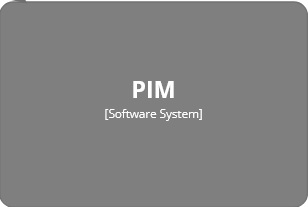
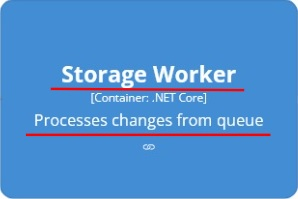
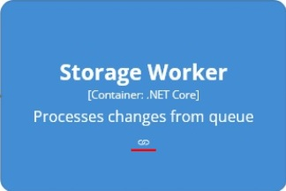
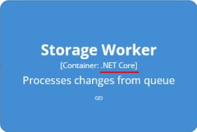
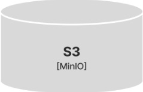
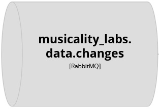
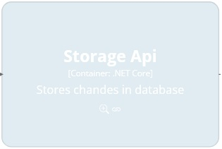

# Conventions for architecture code

## Explicit boundaries of the system

To explicitly indicate the boundaries of the designed system, all external systems are marked with a tag `ExternalSystem`. This makes it easy to recognize the designed system  on the diagram both visually and through automatic analysis.

### Example

```
model {
  pim = softwareSystem "PIM" {
      tags "ExternalSystem"
      ...
  }
}
views {
  ...
  styles {
    element "ExternalSystem" {
      background #7f7f7f
    }
  }
}
```



## Documenting system elements

Elements of the system are given meaningful names and descriptions that answer the questions “what is it” and “why is it needed”.

### Example

```
storageWorker = container "Storage Worker" "Processes changes from queue" {
	...
}
```



## Linking system elements to code

Links to the corresponding repositories are added to the system elements. This will allow the user, both human and automated, to easily move from the abstractions of architecture to the reality of the code that implements it.

### Example

```
storageWorker = container "..." "..." {
    url "https://github.com/…"
    ...
}
```



## Specifying the technologies of system elements

For each element of the system, the technologies used are specified. This will help the user understand what this or that element is based on, and the automation will improve the accuracy of the analysis.

### Example

```
storageWorker = container "..." "..." {
    technology ".NET Core"
    ...
}
```



## Typing of system elements

System elements are typed using tags, for example:
- **Storage** for S3 or databases;
- **MQ** for queues;
- **Frontend** for user interfaces.

This will help to visually separate the elements of architecture of different types, and the automation will improve the quality of analysis.

### Example

```
model {
  pim = softwareSystem "PIM" {
    s3 = container "..." "..." {
      tags "Storage" 
      ...
    }
  }
}
views {
  ...
  styles {
    element "Storage" {
      shape cylinder
    }
  }
}
```



## Explicit declaring of message queues

Message queues are explicitly declared on the architecture using containers or untyped elements. This allows visual demonstration of who writes where, who reads from where, and at the same time readers and writers do not know about each other. In addition, due to the explicit declaration of queues, the code of automatic analyzers is simplified.

### Example

```
model {
  changesMQ = element "musicality_labs.data.changes" "RabbitMQ" {
    tags "MQ" 
  }
}
views {
  ...
  styles {
    element "MQ" {
      shape pipe
    }
  }
}
```



## Marking of obsolete system elements

Obsolete but still active system elements are marked with a tag `Obsolete`. This allows the user to visually determine which elements are worth interacting with and which are not. In addition, the automatic analyzer will be able to calculate the corresponding metrics.

### Example

```
model {
  pim = softwareSystem "PIM" {
    storageApi = container "..." "..."{
      tags "WebApi, Obsolete" 
	  ...
    }
  }
}
views {
  ...
  styles {
    element "Obsolete" {
      background #e0ecf2
    }
  }
}
```


